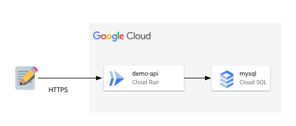
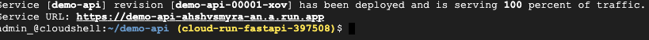
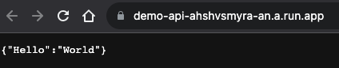
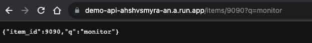
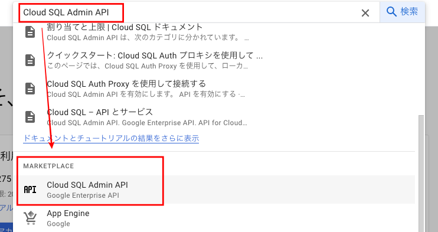
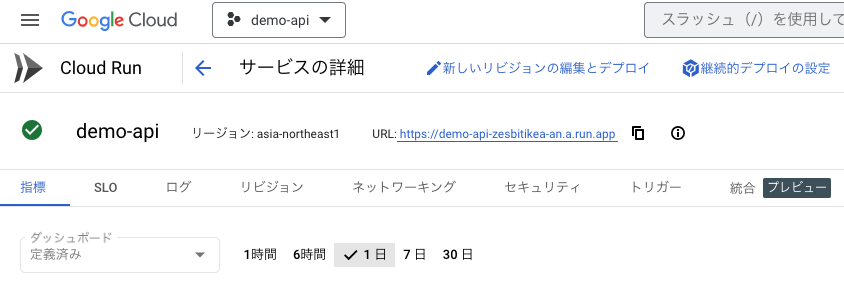
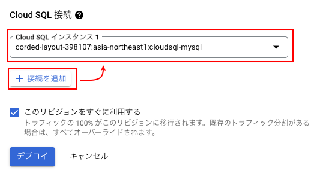
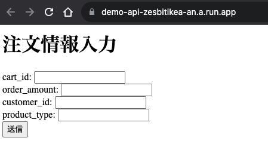
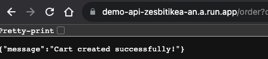

# Cloud Run with FastAPI
## Architecture
  

## Google Cloud Shell の有効化
Google Cloud Shell は、デベロッパー ツールと一緒に読み込まれる仮想マシンです。5 GB の永続ホーム ディレクトリが用意されており、Google Cloud で稼働します。Google Cloud Shell では、コマンドラインで GCP リソースにアクセスできます。

1. GCP Console の右上のツールバーにある [Cloud Shell をアクティブにする] ボタンをクリックします。
2. [続行] をクリックします。環境のプロビジョニングと接続には少し時間がかかります。接続すると、すでに認証されており、プロジェクトは PROJECT_ID に設定されています。  
  

## ソースの準備
1. Project フォルダ作成
```
mkdir demo-api
cd demo-api/
```
2. requirements.txt ファイル作成 
```
vim requirements.txt
```
requirements.txt の内容
```
fastapi>=0.68.0,<0.69.0
pydantic>=1.8.0,<2.0.0
uvicorn>=0.15.0,<0.16.0
```
3. app フォルダ作成
```shell
mkdir app
cd app/
touch __init__.py
vim main.py
```
main.py
```python
from typing import Union

from fastapi import FastAPI

app = FastAPI()

@app.get("/")
def read_root():
    return {"Hello": "World"}

@app.get("/items/{item_id}")
def read_item(item_id: int, q: Union[str, None] = None):
    return {"item_id": item_id, "q": q}
```
4. Dockerfile作成
```shell
cd ~/demo-api/
vim Dockerfile
```
Dockerfile
```yaml
# 使う基本イメージを選択
FROM python:3.9

# 作業フォルダ
WORKDIR /code

# Localから作業フォルダに必要なファイルをCopy
COPY ./requirements.txt /code/requirements.txt

# requirements.txtに定義されたモジュールのインストール
RUN pip install --no-cache-dir --upgrade -r /code/requirements.txt

# ソースCopy
COPY ./app /code/app

# 実行
CMD ["uvicorn", "app.main:app", "--host", "0.0.0.0", "--port", "8080"]
```
Directory
```
├── app
│   ├── __init__.py
│   └── main.py
├── Dockerfile
└── requirements.txt
```

## Cloud Run Build & Deploy
Cloud Run Build
```shell
gcloud builds submit \
  --tag gcr.io/$GOOGLE_CLOUD_PROJECT/demo-api
```
Cloud Run Deploy
```shell
gcloud run deploy demo-api \
  --image gcr.io/$GOOGLE_CLOUD_PROJECT/demo-api \
  --platform managed \
  --region asia-northeast1 \
  --port=8080 \
  --allow-unauthenticated
```
### 確認

  
Query指定
  

## Cloud SQLへアクセス
### Cloud SQL準備
データを保存する Cloud SQL(MySQL)を作成します。
1. ナビゲーション メニューから SQLを選択し、”インスタンスを作成” →　”MySQL”を選択します。
2. インスタンスID : cloudsql-mysql と rootのパスワードを設定し、他のはそのままで “インスタンスを作成”をクリックします。(5分〜10分ほどかかります）
3. データベースアクセスに使うユーザーを作成するために、左メニューから ”ユーザー”を選択し、”ユーザー アカウントを追加”をクリックします。
4. ユーザー名とパスワードを入力し、”追加”をクリックします。(ex: cloudsql-application)
5. データベースとテーブルを作成するために、左メニューから”データベース”を選択し、”データベースの作成”をクリックします。
6. データベース名で “orders” を入れて ”作成”をクリックします。
7. コンソールの検索ボックスで Cloud SQL Admin APIを検索して、APIを有効化します
 
8. 必要なテーブルを作成するために メニューから ”概要”を選択し、「このインスタントの接続」から “CLOUD SHELL を開く”をクリックします。
9. Cloud Shellで表示されている接続コマンドの --user=root を先ほど作成したユーザーの名前に変更して実行します。(ex: --user=cloudsql-application) 
10. アクセスができたらパスワードを入力してログインします。
11. Orders データベースを選択し、下記のSQLで必要なテーブルを作成します。
データベース選択
```sql
use orders
``` 
orders テーブル
```sql
CREATE TABLE `orders` (
  `order_id` int NOT NULL AUTO_INCREMENT,
  `created_date` timestamp NULL DEFAULT CURRENT_TIMESTAMP,
  `cart_id` varchar(255) DEFAULT NULL,
  `order_amount` float(10,2) NOT NULL,
  `customer_id` varchar(255) DEFAULT NULL,
  `product_type` varchar(255) DEFAULT NULL,
  PRIMARY KEY (`order_id`)
) ENGINE=InnoDB AUTO_INCREMENT=10000;
```
12. show コマンドでテーブルが作成できたことを確認します
```sql
mysql> show tables;
+------------------+
| Tables_in_orders |
+------------------+
| orders           |
+------------------+
3 rows in set (0.16 sec)
```
13. exit コマンドで終了します。

## Cloud Run を構成する
1. Cloud Run メニューへ移動します。
2. サービス名をクリックし、[新しいリビジョンの編集とデプロイ] タブをクリックします。
  
3. [コンテナ] タブをクリックし、[Cloud SQL 接続] までスクロールします。
4. [接続を追加] をクリックし、プルダウン メニューから目的の Cloud SQL インスタンスを選択します。
  
5. [デプロイ] をクリックします。

## アプリケーションからCloud SQLの接続を行う
1. requirements.txtへ sqlalchemy と PyMySQLを追加します。  
SQLAlchemy(https://www.sqlalchemy.org/)とは，Pythonの中でよく利用されているORM(Object Relational Mapper)の1つ  
PyMySQL(https://pypi.org/project/pymysql/)とは、MySQLデータベースにアクセスしSQL操作を可能にするデータベースコネクタの1つ. 

requirements.txt
```yaml
fastapi>=0.68.0,<0.69.0
pydantic>=1.8.0,<2.0.0
uvicorn>=0.15.0,<0.16.0
sqlalchemy
PyMySQL
```

2. app/main.py の既存ソースに sqlalchemy を importし、接続関連内容を追加します。
* ここではソース上にアカウント情報をそのまま入れてますが、実際に使う時にはコメントアウトされているソースのようにOSの環境変数を利用するか、Secret Manager(https://cloud.google.com/sql/docs/mysql/use-secret-manager?hl=ja) を利用してください。
main.py
```python
...
from sqlalchemy import create_engine, text

# データベースへの接続情報
#db_user = os.environ["DB_USER"] # e.g. 'my-database-user'
#db_pass = os.environ["DB_PASS"] # e.g. 'my-database-password'
#db_name = os.environ["DB_NAME"] # e.g. 'my-database'
db_username = "cloudsql-application"
db_password = "cloudsql-application"
db_name = "orders"
connection_name = "<<connection_name>>"

# SQLAlchemy接続文字列
connection_str = f"mysql+pymysql://{db_username}:{db_password}@/{db_name}?unix_socket=/cloudsql/{connection_name}"

# SQLAlchemyエンジン生成
engine = create_engine(connection_str)
...
```
3. [データ登録] get method (“/”) でアクセスした場合に簡単な入力フォームを出力するようにソースを追加します。form の actionには “/order” を入れます。
```python
...
from fastapi.responses import HTMLResponse
...
@app.get("/", response_class=HTMLResponse)
def read_root():
    message = '<H1>注文情報入力 </H1>'
    message = message + '<form action="/order" method="get">'
    message = message + ' cart_id: <input type="text" name="cart_id" /></br>'
    message = message + ' order_amount: <input type="text" name="order_amount" /></br>'
    message = message + ' customer_id: <input type="text" name="customer_id" /></br>'
    message = message + ' product_type: <input type="text" name="product_type" /></br>'
    message = message + ' <input type="submit" value="送信" />'
    message = message + '</form>'
    return message
...
```

4. Cloud Runの build & deploy を実行して画面を確認します。（実行は Dockerfile があるPathで実行する必要があります)  
Build
```shell
gcloud builds submit \
  --tag gcr.io/$GOOGLE_CLOUD_PROJECT/demo-api
```
Deploy
```shell
gcloud run deploy demo-api \
  --image gcr.io/$GOOGLE_CLOUD_PROJECT/demo-api \
  --platform managed \
  --region asia-northeast1 \
  --port=8080 \
  --allow-unauthenticated
```
  

5. 入力する内容を DBへ登録する機能を実装します。
```python
...
@app.get("/order")
def create_order(cart_id: str, order_amount: float, customer_id: str, product_type: str):
    query = text("INSERT INTO orders (cart_id, order_amount, customer_id, product_type) VALUES (:cart_id, :order_amount, :customer_id, :product_type) ")
    params = {"cart_id": cart_id, "order_amount": order_amount, "customer_id": customer_id, "product_type": product_type}
    with engine.begin() as connection:
        connection.execute(query, params)

    return {"message": "Cart created successfully!"}
...
```
6. 同じく Cloud Runを Build & Deployをして 入力フォーム（“/” ）からデータを入力し、”送信”を送ってデータを登録します。  
  

7. 現在登録されている情報のリストを出力する機能を実装します。(/order_list)
```python
@app.get("/order_list", response_class=HTMLResponse)
def get_order_list():
    query = text("select * from orders ORDER BY order_id limit 100")
    with engine.begin() as connection:
        result = connection.execute(query)
    html = ""
    for row in result:
        html = html + str(row) + "</br>"
    return html
```
8. １つの order_infoを確認する昨日の実装 (/order_info/{order_id} )
```python
@app.get("/order_info/{order_id}", response_class=HTMLResponse)
def get_order(order_id: str):
    query = text("SELECT * FROM orders WHERE order_id = :order_id")
    params = {"order_id": order_id}
    with engine.begin() as connection:
        result = connection.execute(query, params)
    html = ""
    for row in result:
        html = html + str(row) + "</br>"
    return html
```

## 完成ソース
```python
from typing import Union
from typing import List, Dict

from fastapi import FastAPI
from fastapi.responses import HTMLResponse

from sqlalchemy import create_engine, text

app = FastAPI()

# データベースへの接続情報
#db_user = os.environ["DB_USER"]  # e.g. 'my-database-user'
#db_pass = os.environ["DB_PASS"]  # e.g. 'my-database-password'
#db_name = os.environ["DB_NAME"]  # e.g. 'my-database'
db_username = "cloudsql-application"
db_password = "cloudsql-application"
db_name = "orders"
connection_name = "<<connection_name>>"

# SQLAlchemy接続文字列
connection_str = f"mysql+pymysql://{db_username}:{db_password}@/{db_name}?unix_socket=/cloudsql/{connection_name}"

# SQLAlchemyエンジン生成
engine = create_engine(connection_str)

@app.get("/", response_class=HTMLResponse)
def read_root():
    message = '<H1>注文情報入力 </H1>'
    message = message + '<form action="/order" method="post">'
    message = message + '  cart_id: <input type="text" name="cart_id" /></br>'
    message = message + '  order_amount: <input type="text" name="order_amount" /></br>'
    message = message + '  customer_id: <input type="text" name="customer_id" /></br>'
    message = message + '  product_type: <input type="text" name="product_type" /></br>'
    message = message + '  <input type="submit" value="送信" />'
    message = message + '</form>'
    return message

@app.get("/order")
def create_order(cart_id: str, order_amount: float, customer_id: str, product_type: str):
    query = text("INSERT INTO orders (cart_id, order_amount, customer_id, product_type) VALUES (:cart_id, :order_amount, :customer_id, :product_type) ")
    params = {"cart_id": cart_id, "order_amount": order_amount, "customer_id": customer_id, "product_type": product_type}
    with engine.begin() as connection:
        connection.execute(query, params)

    return {"message": "Cart created successfully!"}

@app.get("/order_list", response_class=HTMLResponse)
def get_order_list():
    query = text("select * from orders ORDER BY order_id limit 100")
    with engine.begin() as connection:
        result = connection.execute(query)
    html = ""
    for row in result:
        html = html + str(row) + "</br>"
    return html

@app.get("/order_info/{order_id}", response_class=HTMLResponse)
def get_order(order_id: str):
    query = text("SELECT * FROM orders WHERE order_id = :order_id")
    params = {"order_id": order_id}
    with engine.begin() as connection:
        result = connection.execute(query, params)
    html = ""
    for row in result:
        html = html + str(row) + "</br>"
    return html

@app.get("/items/{item_id}")
def read_item(item_id: int, q: Union[str, None] = None):
    return {"item_id": item_id, "q": q}

if __name__ == "__main__":
    app.run(debug=True)
```